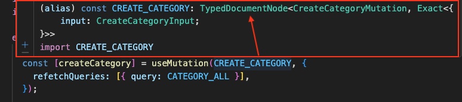
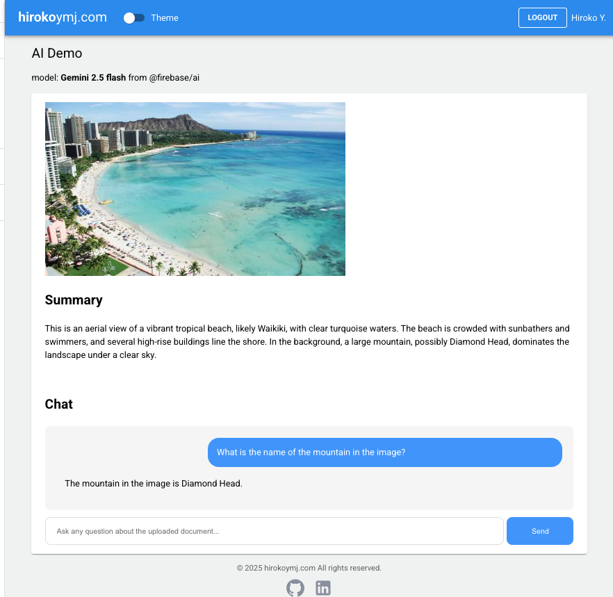

# hirokoymj.com

- Live URL : https://www.hirokoymj.com

## Frontend

- React.js (v19), TypeScript, React Hooks/Context, React Router v6, Redux Toolkit, React Hook Form, Apollo Client(GraphQL), Google Account Authentication, Material UI(v7)

## Backend

- Node.js, TypeScript, MongoDB Atlas/Mongoose, Apollo Server v3 (GraphQL)
- [Backend repository](https://github.com/hirokoymj/hiroko-web-backend-new)
- [Backend API](https://hiroko-web-backend-new-08d39ee2590b.herokuapp.com/)

## Deployment

- Heroku

```js
git heroku login
heroku git:remote -a <app-name>
git push heroku main
```

## GraphQL + Codegen + TypeScript

1. Installing necessary packages.

```js
npm install -D @graphql-codegen/cli @graphql-codegen/client-preset
```

2. Add a generate command in package.json

```js
"scripts": {
  "generate": "graphql-codegen"
},
```

3. Created [codegen.ts](./codegen.ts).
4. Runs `npm run generate` and the queries and mutations are typed.

   

<hr />

## Google Cloud (GCP)

**Google Account Authentication**

1. Firebase console -> Add app -> Web -> Add Firebase to your web app -> Authentication -> Add new provider -> Google -> `npm install firebase` -> Copy Firebase config code in your app.
2. GCP console -> Identity Platform -> Providers -> Edit Google -> Add domain (www.hirokoymj.com)
3. [contexts/authContext.tsx](./src/contexts/authContext.tsx)


<hr />

**Google Map Implementation**

- GCP console -> APIs & Services -> Enable `Maps JavaScript API` -> Add key in the component `<GoogleMapReact bootstrapURLKeys={{ key: "" }}>`

```js
$gcloud services list --enabled
maps-backend.googleapis.com                  Maps JavaScript API
```


## AI @firebase/ai



## References

**React.js**

- [Built-in React Hooks](https://react.dev/reference/react/hooks)
- [React API - CreateContext](https://react.dev/reference/react/createContext)
- [React API - memo](https://react.dev/reference/react/memo)
- [React TypeScript cheetsheet](https://react-typescript-cheatsheet.netlify.app/docs/basic/examples/)

**React Router**

- [React Router - useParams](https://reactrouter.com/6.30.1/hooks/use-params)
- [React Router - createRoutesFromElements](https://reactrouter.com/6.30.1/utils/create-routes-from-elements)

**React Hook Form**

- [React Hook Form](https://react-hook-form.com/)
- [React Hook Form Typescript](https://react-hook-form.com/ts)

**Redux**

- [Redux Toolkit Quikc Start/Install](https://redux-toolkit.js.org/tutorials/quick-start)
- [TypeScript with Apollo Client](https://www.apollographql.com/docs/react/development-testing/static-typing)

**Apollo Client**

- [Queries](https://www.apollographql.com/docs/react/data/queries)
- [Mutations](https://www.apollographql.com/docs/react/data/mutations)

**GCP Cloud library**

- [GCP Signing in user with Google](https://cloud.google.com/identity-platform/docs/web/google)

**Build tool Vite(Veet)**

- https://vite.dev/guide/
- [Migrating from Create React App to Vite:](https://adhithiravi.medium.com/migrating-from-create-react-app-to-vite-a-modern-approach-76148adb8983)
- [How to use process.env in Vite](https://dev.to/whchi/how-to-use-processenv-in-vite-ho9)

**Material UI**

- [Material UI v7](https://mui.com/material-ui/getting-started/)
