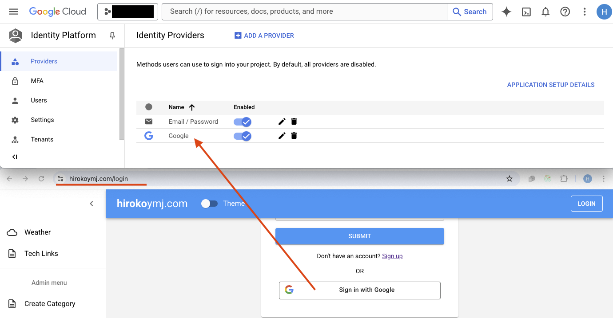

# hirokoymj.com

- Live URL : https://www.hirokoymj.com

## Technologies

**Frontend**

- TypeScript
- React.js (version 19)
- React Hooks, React Context
- React Router v6.3
- Redux Toolkit v2.8
- React Hook Form
- Apollo Client v3 (GraphQL)
- Google Map API
- Firebase Authentication for Google

**Backend** - https://github.com/hirokoymj/hiroko-web-backend-new

- Typescript
- Node.js
- Apollo Server v3
- Mongoose
- Weather API

**Database**

- MongoDB Atlas

## Google Cloud Platform(GCP)

**Implementing Google Account Authentication**

1. Firebase console -> Add app -> Web -> Add Firebase to your web app -> Authentication -> Add new provider -> Google -> `npm install firebase` -> Copy Firebase config code in your app.
2. GCP console -> Identity Platform -> Providers -> Edit Google -> Add domain (www.hirokoymj.com)

- [auth.js](./src/firebase/auth.js)
- [firebase.js](./src/firebase/firebase.js)
- [AuthProvider](./src/contexts/authContext/index.js)
- [LoginButton.jsx](./src/pages/auth/LoginButton.jsx)

<br />



<hr />

**Implementing Google Map in your site**

- GCP console -> APIs & Services -> Enable `Maps JavaScript API` -> Add key in the component `<GoogleMapReact bootstrapURLKeys={{ key: "" }}>`

```js
$gcloud services list --enabled
maps-backend.googleapis.com                  Maps JavaScript API
```


## Deploy this app to Heroku

```js
git heroku login
git push heroku master

git remote -v
heroku  https://git.heroku.com/hiroko-web-frontend.git (fetch)
heroku  https://git.heroku.com/hiroko-web-frontend.git (push)
```

## References

- https://redux.js.org/introduction/getting-started
- https://fir-ui-demo-84a6c.firebaseapp.com/
- https://github.com/firebase/firebaseui-web
- https://firebase.google.com/docs/reference/js
- https://react-hook-form.com/
- https://github.com/jquense/yup
- https://firebase.google.com/docs/auth/web/google-signin
- https://reactrouter.com/home
- https://react.dev/reference/react/createContext
- https://mui.com/material-ui/getting-started/
- https://devcenter.heroku.com/articles/heroku-cli
- https://stackoverflow.com/questions/73158715/how-do-i-set-a-route-as-an-index-if-it-requires-a-parameter
- https://stackoverflow.com/questions/6899582/i-change-the-capitalization-of-a-directory-and-git-doesnt-seem-to-pick-up-on-it
- [Offical doc: Signing in users with Google](https://cloud.google.com/identity-platform/docs/web/google)
