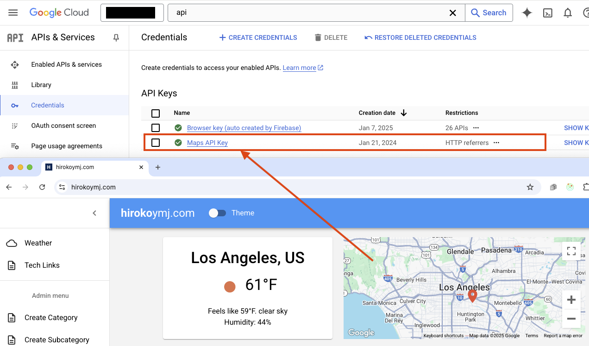

# hirokoymj.com

- Live URL : https://www.hirokoymj.com

## Technologies

**Frontend**

- TypeScript
- React.js (version 19)
- React Hooks, React Context
- React Router v6.3
- Redux Toolkit v2.8
- React Hook Form
- Apollo Client v3 (GraphQL)
- Material UI (version 7)
- Google Map API
- Google Account authentication with Firebase

**Backend** - https://github.com/hirokoymj/hiroko-web-backend-new

- Typescript
- Node.js
- Apollo Server v3
- Mongoose
- Weather API

**Database**

- MongoDB Atlas

## Google Cloud Platform(GCP)

**Implementing Google Account Authentication**

1. Firebase console -> Add app -> Web -> Add Firebase to your web app -> Authentication -> Add new provider -> Google -> `npm install firebase` -> Copy Firebase config code in your app.
2. GCP console -> Identity Platform -> Providers -> Edit Google -> Add domain (www.hirokoymj.com)
3. [contexts/authContext.jsx](./src/contexts/authContext.jsx)


<hr />

**Implementing Google Map in your site**

- GCP console -> APIs & Services -> Enable `Maps JavaScript API` -> Add key in the component `<GoogleMapReact bootstrapURLKeys={{ key: "" }}>`

```js
$gcloud services list --enabled
maps-backend.googleapis.com                  Maps JavaScript API
```



## Deploy this app to Heroku

```js
git heroku login
git push heroku main
// Check remote repo
git remote -v
```

## References

- [Built-in React Hooks](https://react.dev/reference/react/hooks)
- [React API - CreateContext](https://react.dev/reference/react/createContext)
- [React API - memo](https://react.dev/reference/react/memo)
- [React Hook Form](https://react-hook-form.com/)
- [React Hook Form Typescript](https://react-hook-form.com/ts)
- [React TypeScript cheetsheet](https://react-typescript-cheatsheet.netlify.app/docs/basic/examples/)
- [Redux Toolkit Quikc Start/Install](https://redux-toolkit.js.org/tutorials/quick-start)
- [TypeScript with Apollo Client](https://www.apollographql.com/docs/react/development-testing/static-typing)
- [Queries](https://www.apollographql.com/docs/react/data/queries)
- [Mutations](https://www.apollographql.com/docs/react/data/mutations)
- [GCP Signing in user with Google](https://cloud.google.com/identity-platform/docs/web/google)
- [Material UI v7](https://mui.com/material-ui/getting-started/)
